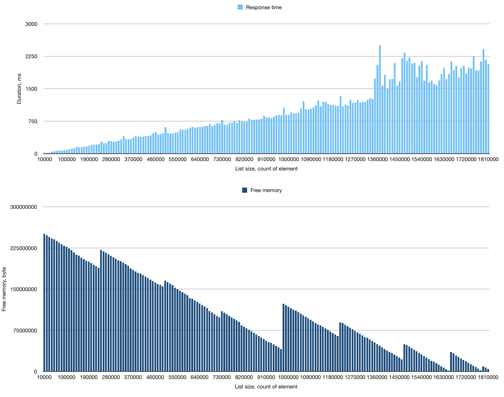
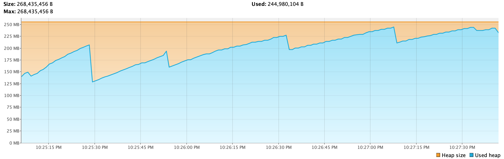
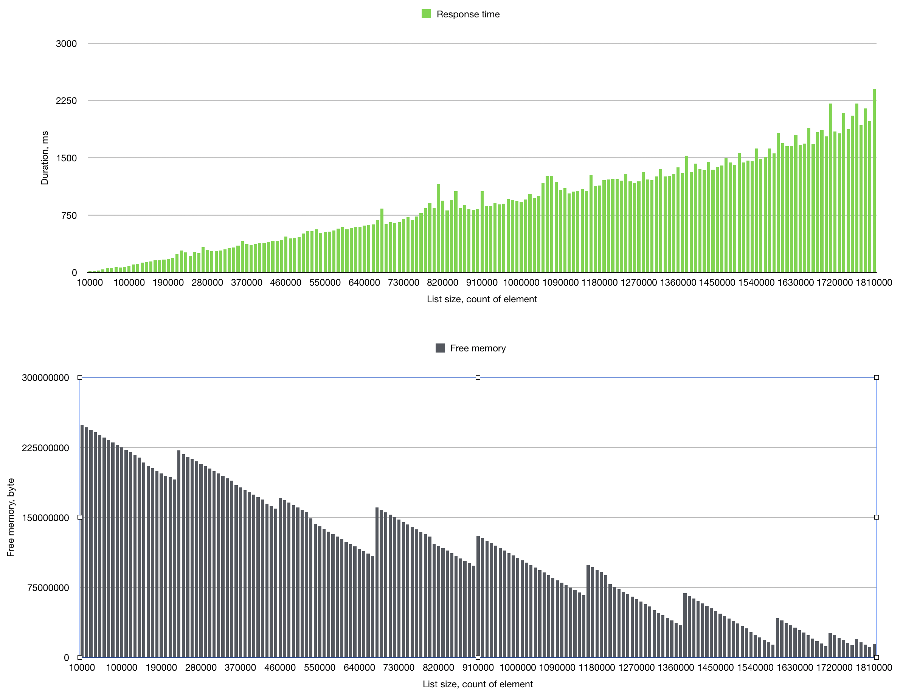
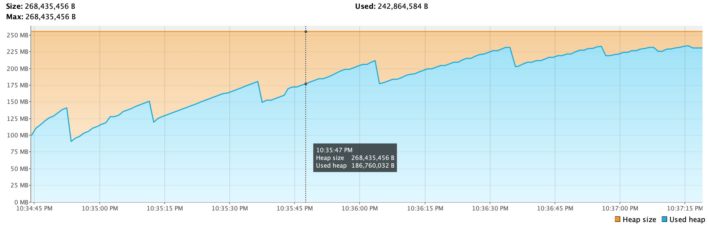
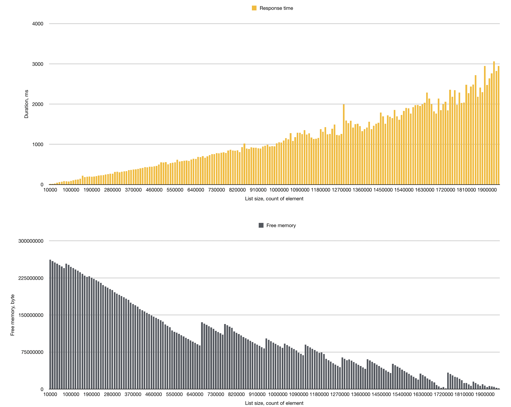
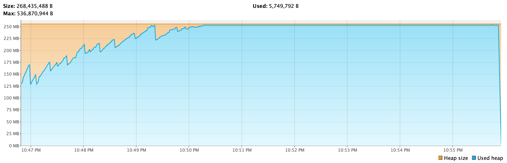
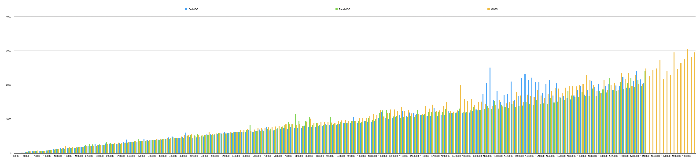

# Сравнение GC

### Постановка задачи
Необходимо определить какой из встроенных сборщиков мусора вирутальной машины HotSpot наиболее применим в приложении.
Целью оптимизации является уменьшение времени отклика приложения и увеличение длительности "жизни" приложения в условиях утечки памяти.

### Допущения
1. Использовались дефолтные настройки GC
2. При измерении не учитываются внутренние оптимизации JVM

### Методика эксперимента
Измеряемый алгоритм находится в методе run класса Benchmark.
Алгоритм выполняет вставку 20000 обектов Unit и последующее удаление 10000 экземпляров.
Замер начинается перед вставкой и заканчивается после удаления. 

После исполнения алгоритма логируются 4 параметра: 
* Длительность выполнения
* Размер ArrayList после выполнения
* Время окончания выполнения алгоритма
* Свободная память Heap'а

Все эксперименты проводятся со стартовым размером Heap равным 256 Мб и ограничением Heap в 256 Мб.

### Оценка сложности исполняемого алгоритма
Алгоритм состоит из последовательного исполнения двух циклов. 
В первом цикле выполняется операция add со сложность O(1).
Первый цикл выполняется за константное время.
Во втором цикле операция remote со сложностью O(n).
Не смотря на то, что размер ArrayList уменьшается при каждом проходе цикла, в целях поставленной задачи можно предположить, 
что прирост длительности исполнения будет близок к линейному и только зависеть от начального размера ArrayList.

### Результаты
#### Общие показатели
| Garbage collector | Кол-во минорных сборок  | Время на минорные сборки, мс | Кол-во мажорных сборок  | Время на мажорные сборки, мс  | Время жизни приложения, мс  | Максимальный размер List  |
|-------------------|-------------------------|------------------------------|-------------------------|-------------------------------|-----------------------------|---------------------------|
| Serial GC         | 6                       | 214                          | 7                       | 1823                          | ~177478                     | 1810000                   |
| Parallel GC       | 4                       | 145                          | 10                      | 1962                          | ~168401                     | 1810000                   |
| G1GC              | 1472                    | 4265                         | 2776                    | 306203                        | ~219760                     | 1950000                   |

\* Подавляющее число сборок у G1GC было проведено при наличии малого количества свободной памяти.   
Сборщик G1GC в течении 5 минут загружал 5 ядер процессора под 100%,
ему героически удалось прогнать еще один цикл алгоритма, но его мы не будем учитывать в общем сравнении.

#### SerialGC
 
 
#### ParallelGC
 

#### G1GC
 

#### В сравнении
 

### Выводы
Для исследуемого приложения с целью увеличения продолжительности "жизни" рекомендуется G1GC.  
Для стабилизации времени отклика предлагается ParallelGC.