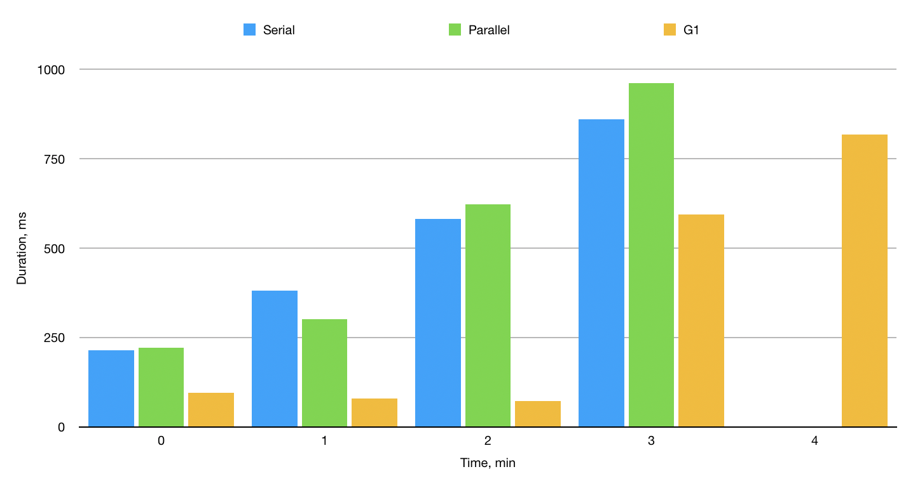

# Сравнение GC

### Постановка задачи
Необходимо определить какой из встроенных сборщиков мусора вирутальной машины HotSpot наиболее применим в приложении.
Целью оптимизации является уменьшение времени отклика приложения и увеличение "длительности жизни" приложения в условиях утечки памяти.
Под "длительностью жизни" понимается время работы приложения, в период которого оно способно отвечать на запросы без экстра задержки, вызванной утечкой памяти.

### Допущения
1. Использовались дефолтные настройки GC
2. При измерении не учитываются внутренние оптимизации JVM

### Методика эксперимента
Измеряемый алгоритм находится в методе run класса Benchmark.
Алгоритм выполняет вставку 20000 обектов Unit и последующее удаление 10000 экземпляров.
Замер начинается перед вставкой и заканчивается после удаления. 

После исполнения алгоритма логируются 4 параметра: 
* Длительность выполнения
* Размер ArrayList после выполнения
* Время окончания выполнения алгоритма
* Свободная память Heap'а

Все эксперименты проводятся со стартовым размером Heap равным 256 Мб и ограничением Heap в 256 Мб.

### Оценка сложности исполняемого алгоритма
Алгоритм состоит из последовательного исполнения двух циклов. 
В первом цикле выполняется операция add со сложность O(1).
Первый цикл выполняется за константное время.
Во втором цикле операция remote со сложностью O(n).
Несмотря на то, что размер ArrayList уменьшается при каждом проходе цикла, в целях поставленной задачи можно предположить, 
что прирост длительности исполнения будет близок к линейному и только зависеть от начального размера ArrayList.

### Результаты
#### Общие показатели
| Garbage collector | Кол-во минорных сборок  | Время на минорные сборки, мс | Среднее время на минорные сборки, мс | Макс время на минорную сборку, мс | Кол-во мажорных сборок  | Время на мажорные сборки, мс  | Среднее время на мажорные сборки, мс | Макс время на мажорную сборку, мс | Время жизни приложения (до отказа), мс  | Максимальный размер List  |
|-------------------|-------------------------|------------------------------|--------------------------------------|-----------------------------------|-------------------------|-------------------------------|--------------------------------------|-----------------------------------|-----------------------------------------|---------------------------|
| Serial GC         | 6                       | 214                          | 36                                   | 87                                | 7                       | 1823                          | 260                                  | 320                               | ~177478                                 | 1810000                   |
| Parallel GC       | 4                       | 145                          | 36                                   | 46                                | 10                      | 1962                          | 196                                  | 262                               | ~168401                                 | 1810000                   |
| G1GC              | 44 (1472)               | 362 (4265)                   | 8                                    | 20                                | 13 (2776)               | 1298 (306203)                 | 100                                  | 116                               | ~219760                                 | 1950000                   |

\* Подавляющее число сборок у G1GC было проведено при наличии малого количества свободной памяти.   
Сборщик G1GC в течении 5 минут загружал 5 ядер процессора под 100%,
ему героически удалось прогнать еще один цикл алгоритма, но его мы не будем учитывать в общем сравнении. 
В скобках для G1GC указаны значения с учетом последнего цикла.

#### SerialGC
 
Рис.1 - Время выполнения алгоритма и размер свободной памяти Heap при использовании SerialGC
 
Рис.2 - Размер Heap по времени при использовании SerialGC
#### ParallelGC
 
Рис.3 - Время выполнения алгоритма и размер свободной памяти Heap при использовании ParallelGC

Рис.4 - Размер Heap по времени при использовании ParallelGC
#### G1GC
 
Рис.5 - Время выполнения алгоритма и размер свободной памяти Heap при использовании G1GC

Рис.6 - Размер Heap по времени при использовании G1GC
#### В сравнении
 
Рис.7 - Время выполнения алгоритма в сравнении
 
Рис.8 - Время затраченное на сборки по минутам

### Выводы
Для исследуемого приложения с целью увеличения "длительности жизни" рекомендуется G1GC. 
Также стоит отметить, что G1GC в разбивке по минутам (рис.8) затратил меньшее времени на сборки мусора нежели его конкуренты.
Но по времени выполнения алгоритма (рис.7) G1GC показал не лучшие результаты. 
Однозначно рекомендовать G1GC для уменьшения времени отклика полученные результаты не позволяют. 
Необходимо дальнейшее исследование с серией экспериментов и применением более точных инструментов замера времени работы алгоритма.